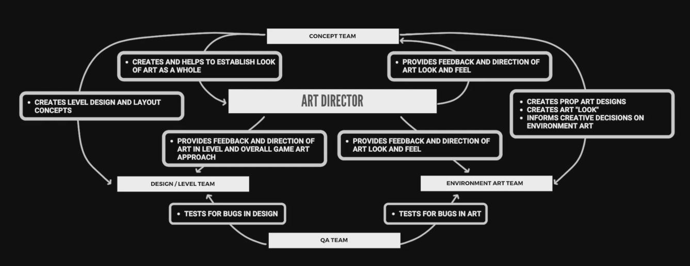
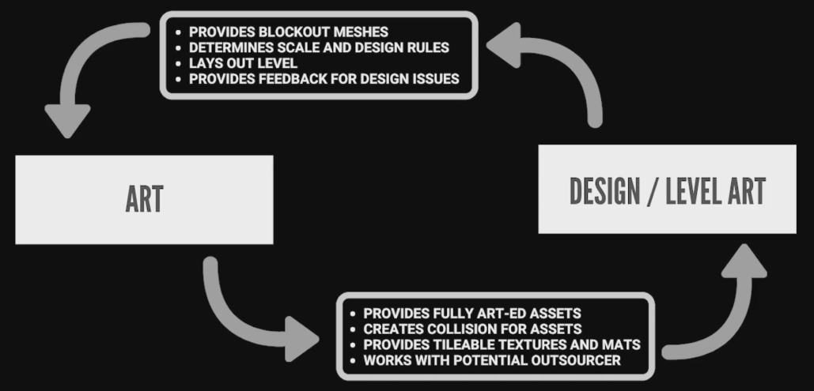

# Becoming an Environment Artist in Unreal

>## Table Of Contents

 - [Introduction to Environment Art](#introduction-to-environment-art)
 - [Department Interactions in Development](#department-interactions-in-development)

---
## Introduction to Environment Art

 -[TOC](#table-of-contents)

What you will learn
 - Terminology of environment art within game production and unreal
 - Folder structure and file naming
 - Importing meshes, textures and assets into unreal properly
 - Using the grid and planning with modular workflows
 - Texture settings, density and usage
 - Blockout meshes and understanding mesh footprints
 - Material creation
 - Collision setup
 - optimization
 - Lighting overview and lightmaps

Secions of this course
 - Section 1 - Pre-production
 - Section 2 - Tools in Unreal
 - Section 3 - Materials and Lighting

---
## Department Interactions in Development

 -[TOC](#table-of-contents)

- What responsibilities does an environment artist have
- The chain of command
- Steps from concept, art, design, level layout and QA
- Interacting with design for gameplay
- Working with different size teams

### Responsibilities of an Environment Artist
 
 - Creating props and assets
 - Creating textures
 - Creating materials
 - Work directly with design and level art to make levels and environments
 - Creating collisions, LODs, lightmaps for assets
 - Brainstorming and creating advanced blockout shapes and designs for level layout
 - Collaborating with other members to members to complete deadlines or sprints during production

### Game Environment Production

### Working With Designers

### Team Size

- AAA Studios / Larger Teams
  -- --
  Generally more specialized tasks, larger art team, more resources, slightly less learning of other disciplines, more focused tasking

- AA or Indie Studios / Midsize Teams
  -- --
  Broader tasks and assignments, less management and more creative control on tasks, mid to small size art team, less resources, lots of learning of other skills

- Start ups and Groups / small Size Teams
  -- --
  Working on multiple aspects out of environment art, typically not a lot of management, good for people that can self manage their time, requires a lot of self discipline, learn a lot of things that you would have never had a chance to try

---  