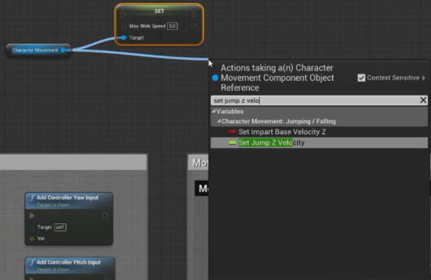

# EPIC GAMES - UNREAL ENGINE

>## Table of content

  - [Introduction To Unreal Engine](#introduction-to-unreal-engine)
  - [Blueprints And Gameplay For Game Designers](#blueprints-and-gameplay-for-game-designers)
     - [Introduction To Course](#introduction-to-course)
     - [What Is a Gameplay Designer](#what-is-a-gameplay-designer)
     - [The First Person Character](#the-first-person-character)
     - [Changing Component Variables](#changing-component-variables)
     - [Experimenting With Variables At Runtime](#experimenting-with-variables-at-runtime)
     - [Adding Sprint](#adding-sprint)
     - [Adding Crouch](#adding-crouch)
     - [Adding Health And Debug Damage](#adding-health-and-debug-damage)
     - [Widget Blueprint Introduction](#widget-blueprint-introduction)
     - [Post Process Volumes](#post-process-volumes)
     - [Creating The Door Parent](#creating-the-door-parent)
     - [Opening On Overlap](#opening-on-overlap)
---

# UNREAL ENGINE

-[Toc](#table-of-content)

## Introduction To Unreal Engine

Unreal Engine is a game engine developed by Epic Games, first showcased in the 1998 first-person shooter game Unreal. Initially developed for PC first-person shooters, it has since been used in a variety of genres of three-dimensional (3D) games and has seen adoption by other industries, most notably the film and television industry. Written in C++, the Unreal Engine features a high degree of portability, supporting a wide range of desktop, mobile, console and virtual reality platforms.

The latest generation is Unreal Engine 4, which was launched in 2014 under a subscription model. Since 2015, it can be downloaded for free, with its source code available on a GitHub private repository. Epic allows its use in commercial products based on a royalty model, typically asking developers for 5% of revenues from sales, though Epic waives this fee for developers that publish their games through the Epic Games Store. On May 13, 2020, Epic announced that their portion of royalties for games developed in Unreal Engine are waived until developers have earned their first US$1 million in revenue, retroactively applying to January 1, 2020. Unreal Engine 5 is scheduled for full release in early 2022.

It is popular among PC and console games with high graphics capabilities and is used for numerous games, as well as finding further use in filmmaking and other business applications.

>## Blueprints And Gameplay For Game Designers
---
## Introduction To Course
-[Toc](#table-of-content)

What You Will Learn :

- The role of a Gameplay Designer in a team with Unreal
- Change variables at runtime
- Debugging your work
- Setting up input for your project
- Setting up a parent blueprint
- Creating Child Blueprints to build on the logic of the parent
- Basics to Sounds and Particles
- Utilizing a Post Process Effect
- How to use Timelines
- The basics of UMG
----  
## What Is a Gameplay Designer
-[Toc](#table-of-content)

 The responsibilities of a gameplay designer and what is expected of them on a beginner level in the team.

- Produce concepts for new gameplay items & systems
- Look for areas of improvemnt with the current design
- Author and Maintain Design Documents
- Work in a collaborative environment ,  Knowing how to communicate with other departments
- Be able to make quick iterations

Responsibilities in Unreal Engine
- Have a basic knowledge of most tools available in UE
- Know how to quickly change variables
- Be able to create new variations of existing actors

---
## The First Person Character
-[Toc](#table-of-content)

A look at the player character Blueprint that’s already there before we start playing around with some movement variables.

Here are some most common variables that you need to know

Now open UNREAL ENGINE and go to first person template. 

Look for First Person Character Blueprint in the **content browser** OR just locate your asset by clicking on it and press **Ctrl+B** , it will take you directly to the asset in the content browser.
You can find it named BP_FirstPersonCharacter.

By double clicking on the BP_FirstPersonCharacter asset, you can enter into the character blueprint, where you can see the **EVENT GRAPH , CONSTRUCTION SCRIPTS , VIEWPORT , COMPONENTS , FUNCTIONS , VARIABLES , DETAILS PANEL** , etc...

---
## Changing Component Variables
-[Toc](#table-of-content)

 In this topic we ,
   - Create our own Variables
   - Change variables on Begin play
     - Show comment functionality
     - Show editable variables
   - Level instance settings
     -Saving the level instance settings to your character

Here our goal is to overide Maximum walk speed and Jump Height with our on New variables.

Goto *First person player character*
We want to replace the variables that are part of **CharacterMovement** component. 

 

Drag and Drop the **CharacterMovement** component to the Event Graph to get the reference .

Drag  from the reference to **SET** or **GET** variables from the components. Look for *max walk speed* , you will get a **Get Max Walk Speed** and a **Set Max Walk Speed**. Select the **Set Max Walk Speed**. This will now overide the value of the variable in this component.
 

Now we want to do the same for JUMPING HEIGHTS.Look for **set jump z velocity** to overide the variable. 

We want the jump overide to happen after we overidden the *max walk speed*. 

What happened now is , we have set the both variables to *zero*. Now we are going to create our on variables.
Goto **Blueprint** tab, under that, goto **Variables** tab and click on the *add variable* button.

Name the New variable as **FP_MaxWalkSpeed** (FP stands for First Person). Click on Enter and goto the **Details** panel.
Change the *Variable Type* from **Boolean** to **float**. To Edit the **DEFAULT VALUE** , you need to *compile* the code first. Now lets try changing the default value to 500 and then compile and save the same.

We have another method of creating a new variable. We can do it on *Max jump height*.

Right click on the *Green Node* near the **Jump Velocity** in the  **set jump z velocity** and click on **Promote to Variable**.
This will add a New variable and set its **Variable Type** automatically (Float in this case).
Now name the newly created variable as **FP_MaxJumpHeight**. Compile and set its Default value to 500. 
Value of Jump height would be now changed, but still you can see that value of Max walk speed is *zero*.
Goto the Variables tab and Drag **FP_MaxWalkSpeed** to the Event Graph. You can see a **GetFP_MaxWalkSpeed** and a **SetFP_MaxWalkSpeed**, select the **GetFP_MaxWalkSpeed** and connect it the node with **Max walk speed**. 

    You can hold Ctrl and Drag to get a GET variable
    and hold Alt and Drag to get a SET variable automatically.

Now we have just created some variables and nothing is there which is going to make this happen. The variables are never being called , they are just hovering in the Event Graph. We want them to happen as soon as the game starts. We need an Event for that.
Right click in the Event graph and look for the event **EventBeginPlay**.

Connect it to  **Set Max Walk Speed**. Now , as soon as the game starts , we overide the  **Max Walk Speed** with the new variable and we overide the **Jump z velocity** with the other new variable.

Even though the variables are responding, you won't be able to change them on the level instance over actor. It is because the variables that you made are not made to be public.
Goto the Blueprint tab on the First person player character and click on the *eye* icon to make it public. Now you would be able to make it public and it would be editable in the instance of the blueprint.

    Another method to make variable Public is to check tick mark on the INSTANCE EDITABLE in the DETAILS panel.

The next thing you would have to do is to make your EVENT GRAPH neat and clean. Select all the newly crated Events and variables and press **C** to **comment** it. Rename it and give a brief description. Here , we can name it as **Beginplay - Set movement variables**. Goto the details Panel and give a colour to recognise the Beginplay easily.

---

## Experimenting With Variables At Runtime
-[Toc](#table-of-content)

---
## Adding Sprint
-[Toc](#table-of-content)

---
## Adding Crouch

-[Toc](#table-of-content)

---
## Adding Health And Debug Damage
-[Toc](#table-of-content)

---

## Widget Blueprint Introduction
-[Toc](#table-of-content)

---

## Post Process Volumes
-[Toc](#table-of-content)

---

## Creating The Door Parent

-[Toc](#table-of-content)

----
## Opening On Overlap
-[Toc](#table-of-content)

---
---
***KEEP LEARNING***
---
---
---
