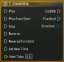
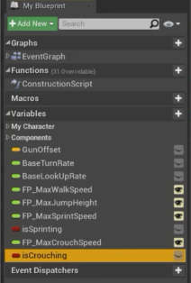

# EPIC GAMES - UNREAL ENGINE


>## Table of Content

  - [Introduction To Unreal Engine](#introduction-to-unreal-engine)
  - [Blueprints And Gameplay For Game Designers](#blueprints-and-gameplay-for-game-designers)
     - [Introduction To Course](#introduction-to-course)
     - [What Is a Gameplay Designer](#what-is-a-gameplay-designer)
     - [The First Person Character](#the-first-person-character)
     - [Changing Component Variables](#changing-component-variables)
     - [Experimenting With Variables At Runtime](#experimenting-with-variables-at-runtime)
     - [Adding Sprint](#adding-sprint)
     - [Adding Crouch](#adding-crouch)
     - [Adding Health And Debug Damage](#adding-health-and-debug-damage)
     - [Widget Blueprint Introduction](#widget-blueprint-introduction)
     - [Post Process Volumes](#post-process-volumes)
     - [Creating The Door Parent](#creating-the-door-parent)
     - [Opening On Overlap](#opening-on-overlap)
---

# UNREAL ENGINE

 -[Toc](#table-of-content)


## Introduction To Unreal Engine

Unreal Engine is a game engine developed by Epic Games, first showcased in the 1998 first-person shooter game Unreal. Initially developed for PC first-person shooters, it has since been used in a variety of genres of three-dimensional (3D) games and has seen adoption by other industries, most notably the film and television industry. Written in C++, the Unreal Engine features a high degree of portability, supporting a wide range of desktop, mobile, console and virtual reality platforms.

The latest generation is Unreal Engine 4, which was launched in 2014 under a subscription model. Since 2015, it can be downloaded for free, with its source code available on a GitHub private repository. Epic allows its use in commercial products based on a royalty model, typically asking developers for 5% of revenues from sales, though Epic waives this fee for developers that publish their games through the Epic Games Store. On May 13, 2020, Epic announced that their portion of royalties for games developed in Unreal Engine are waived until developers have earned their first US$1 million in revenue, retroactively applying to January 1, 2020. Unreal Engine 5 is scheduled for full release in early 2022.

It is popular among PC and console games with high graphics capabilities and is used for numerous games, as well as finding further use in filmmaking and other business applications.


>## Blueprints And Gameplay For Game Designers
---
## Introduction To Course

 -[Toc](#table-of-content)

What You Will Learn :

- The role of a Gameplay Designer in a team with Unreal
- Change variables at runtime
- Debugging your work
- Setting up input for your project
- Setting up a parent blueprint
- Creating Child Blueprints to build on the logic of the parent
- Basics to Sounds and Particles
- Utilizing a Post Process Effect
- How to use Timelines
- The basics of UMG
----  
## What Is a Gameplay Designer

 -[Toc](#table-of-content)

 The responsibilities of a gameplay designer and what is expected of them on a beginner level in the team.

- Produce concepts for new gameplay items & systems
- Look for areas of improvemnt with the current design
- Author and Maintain Design Documents
- Work in a collaborative environment ,  Knowing how to communicate with other departments
- Be able to make quick iterations

Responsibilities in Unreal Engine
- Have a basic knowledge of most tools available in UE
- Know how to quickly change variables
- Be able to create new variations of existing actors

---
## The First Person Character

 -[Toc](#table-of-content)


A look at the player character Blueprint that’s already there before we start playing around with some movement variables.

Here are some most common variables that you need to know


Now open UNREAL ENGINE and go to first person template. 


Look for First Person Character Blueprint in the **content browser** OR just locate your asset by clicking on it and press **Ctrl+B** , it will take you directly to the asset in the content browser.
You can find it named BP_FirstPersonCharacter.


By double clicking on the BP_FirstPersonCharacter asset, you can enter into the character blueprint, where you can see the **EVENT GRAPH , CONSTRUCTION SCRIPTS , VIEWPORT , COMPONENTS , FUNCTIONS , VARIABLES , DETAILS PANEL** , etc...


---
## Changing Component Variables

 -[Toc](#table-of-content)

 In this topic we ,
   - Create our own Variables
   - Change variables on Begin play
     - Show comment functionality
     - Show editable variables
   - Level instance settings
     -Saving the level instance settings to your character

Here our goal is to overide Maximum walk speed and Jump Height with our on New variables.

Goto *First person player character*
We want to replace the variables that are part of **CharacterMovement** component. 

 

Drag and Drop the **CharacterMovement** component to the Event Graph to get the reference .

Drag  from the reference to **SET** or **GET** variables from the components. Look for *max walk speed* , you will get a **Get Max Walk Speed** and a **Set Max Walk Speed**. Select the **Set Max Walk Speed**. This will now overide the value of the variable in this component.

 

Now we want to do the same for JUMPING HEIGHTS.Look for **set jump z velocity** to overide the variable.


We want the jump overide to happen after we overidden the *max walk speed*. 


What happened now is , we have set the both variables to *zero*. Now we are going to create our on variables.
Goto **Blueprint** tab, under that, goto **Variables** tab and click on the *add variable* button.


Name the New variable as **FP_MaxWalkSpeed** (FP stands for First Person). Click on Enter and goto the **Details** panel.
Change the *Variable Type* from **Boolean** to **float**. To Edit the **DEFAULT VALUE** , you need to *compile* the code first. Now lets try changing the default value to 500 and then compile and save the same.


We have another method of creating a new variable. We can do it on *Max jump height*.


Right click on the *Green Node* near the **Jump Velocity** in the  **set jump z velocity** and click on **Promote to Variable**.
This will add a New variable and set its **Variable Type** automatically (Float in this case).
Now name the newly created variable as **FP_MaxJumpHeight**. Compile and set its Default value to 500. 
Value of Jump height would be now changed, but still you can see that value of Max walk speed is *zero*.
Goto the Variables tab and Drag **FP_MaxWalkSpeed** to the Event Graph. You can see a **GetFP_MaxWalkSpeed** and a **SetFP_MaxWalkSpeed**, select the **GetFP_MaxWalkSpeed** and connect it the node with **Max walk speed**. 


    You can hold Ctrl and Drag to get a GET variable
    and hold Alt and Drag to get a SET variable automatically.

Now we have just created some variables and nothing is there which is going to make this happen. The variables are never being called , they are just hovering in the Event Graph. We want them to happen as soon as the game starts. We need an Event for that.
Right click in the Event graph and look for the event **EventBeginPlay**.


Connect it to  **Set Max Walk Speed**. Now , as soon as the game starts , we overide the  **Max Walk Speed** with the new variable and we overide the **Jump z velocity** with the other new variable.

Even though the variables are responding, you won't be able to change them on the level instance over actor. It is because the variables that you made are not made to be public.
Goto the Blueprint tab on the First person player character and click on the *eye* icon to make it public. Now you would be able to make it public and it would be editable in the instance of the blueprint.


    Another method to make variable Public is to check tick mark on the INSTANCE EDITABLE in the DETAILS panel.

The next thing you would have to do is to make your EVENT GRAPH neat and clean. Select all the newly crated Events and variables and press **C** to **comment** it. Rename it and give a brief description. Here , we can name it as **Beginplay - Set movement variables**. Goto the details Panel and give a colour to recognise the Beginplay easily.


---

## Experimenting With Variables At Runtime

 -[Toc](#table-of-content)

We will add **DEBUG CONTROLS** that will allow us to change the variables while we play.

Here for a reference, we are Dynamically changing the variables with scroll wheel up/down.
We need the movement speed to go up , when we scroll the mouse wheel up and the movement speed to go down when we scroll the mouse wheel down.

Right click on the Event Graph and search for **Mouse Wheel Up** and **Mouse Wheel Down**.


You can see **Pressed** and **Released** in both of them.
We need a **Character Movement** to happen when the mouse wheel is **pressed** or **released** (Here we just need **pressed** to happen). So Drag the **CharacterMovement** component from the components tab. Set **Max walk speed** from it for both **Mouse Wheel Up** and **Mouse Wheel Down** and connect the **Max walk speed** to the **Pressed** in both.


Now we need to change the values. For that we need a **Get Max Walk Speed**. Drag a node from the **CharacterMovement** and search for **Get Max Walk Speed**. From the **Get Max Walk Speed**, drag a node and look for **float + float** to change the value when the wheel is scrolled up and **float - float** to change the value when the wheel is scrolled down. Change the float values to how much you want to increase or decrease the speed when scrolled. Lets take 100 for an example. 


Now compile and play to see the changes.
You can see that the speed has been changing whenever you scrolls the mouse wheel, but you wont have any idea on how much the current speed is while playing. For that we need to **Print string** to feedback the information about speed to ourselves.

Right click and search for **Print String** and connect it to the **Max walk speed**. To print back the information, connect the float with **Max walk speed** to the **String** in the **Print String**. Click the down arrow on the **Print String** and change the duration for how many seconds the string is to be displayed on the screen.


Do the same for **Mouse Wheel Down**. Then Compile and save.


Now play to see whether it is printing the speed on the screen or not. 


Now back to the Event Graph and select the changes we made to **comment** it out. Comment and describe the debug. Let it be **Debug - Change Movement Speed** and colour it down to recognise the debug (usually debugs are coloured in RED.)


---
## Adding Sprint

 -[Toc](#table-of-content)

 - Adding a new input to Project Settings
 - Using the new input in **First Person Character**
 - Setting up logic to adjust the speed for when the input is pressed and released.

To add a new input, goto the **Project Settings** and then under **Engine** click on **input**.
On **input**, you can see **Bindings**.
You will get **action mapping** and **axis mapping**.
Under **action mapping**, you will see *jump, fire* and *resetVR*. Click on the '+' button on **action mapping** to add a new input.


Rename the input to ***Sprint*** and assign keys to it by clicking '+' button next to it. Assign *left shift* key for it, or any other as if you are comfortable or may be multiple keys.


Goto the **First Person Character** Blueprint editor Event Graph and Right click and search for the event **Sprint**. You will be able to see the **InputAction Sprint**, having a **Pressed** and a **Released** actions.


Now you need the Character movement to happen. So, drag the **CharacterMovement** component and bring out **Set Max Walk Speed** from it for both  **Pressed** and **Released** and link them.


Make sure you have variable to change the speed. For that, you can goto **FP_MaxWalkSpeed** in the variables tab and *Duplicate* it and rename it as **FP_MaxSprintSpeed** and then compile and save to change the values.


    You can use Ctrl + W to duplicate. 

Select the **FP_MaxSprintSpeed** and goto the details panel and change the default value to 800. Compile and save.

Drag the variable **FP_MaxSprintSpeed** by holding **Ctrl** to get a *Get variable* to the Event Graph and connect it to the  **Set Max Walk Speed** while **Pressed** and drag **FP_MaxWalkSpeed** by holding Ctrl and connect it to the **Set Max Walk Speed** while **Released**. Compile and save and play.


It might be a good idea to keep track of the fact that if we are sprinting or not. So we want to create a new variable for that and that would be a **Boolean**. Add a new variable and name it as **IsSprinting**, as we need to know whether the character is sprinting or not.


You can keep it not editable for the level instance. 
Drag **IsSprinting** by holding **Alt** to get a **SET variable**. Drag one more copy of it to connect it up for both **Pressed** and **Released**. Give a check mark for **IsSprinting** in the **Pressed** and leave the **IsSprinting** in the **Released** as it is. Select the New changes that you have made and comment it down. Compile and Save.


---
## Adding Crouch

 -[Toc](#table-of-content)

- Adding a new input to Project Settings
- Using the new input to **First Person Character**
- Introduction to **Timeline**
  - Gradually change variables
  - Update component locations

Goto *project settings* and add a new input **Crouch** and assign keys to it. Let **C** and **Left Ctrl** be the crouching keys.


Now on the Event Graph, Right click and call the event **InputActionCrouch**. Assign **CharacterMovement** and **Max Walk Speed** when **Pressed** and **Released**.


Create a variable for maximum crouch speed. Duplicate the **FP_MaxSprintSpeed** in the variables tab and rename it as **FP_MaxCrouchSpeed**. Compile and Save and change the default value to 200.

Drag the variable (**GET variable**) out and connect to the **Max Walk Speed** when **Pressed**. Compile , Save and Play to see the result.


But we would not be getting a smooth motion while crouching. So, inorder to get a smooth motion, we need to use the **Timeline**.
Right click on the Event Graph and search for **Timeline** and Rename it as **T_Crouching**.



Assign it to **Play** while **Pressed** and **Reverse** while **Released** to get a smooth motion.


Double click on the **Timeline** to goto the **T_CrouchingTerminal**. You can see **Length** duration on it, it indicates how long we need to crouch down. Set the **Length** to 0.5 seconds.


We need to Gradually go from Value 1 to Value 2, for that we need to use a **Float Track**  . Click on the **Float Track Button** and name it **Crouch_Alpha** (an Alpha is a value that usually goes from 0 to 1). When the time is 0, we need the value to be 0, Right click on 0 in the timeline and add value of 0 to it.


And after 0.5 seconds on the timeline add a value of 1, that is, we need the the crouch to be completed at 0.5 seconds. You can see a straight line from value 0 to 1.


To smooth it out, select both the points, Right click on any of the points, and change the **key interpolation** to **User**.


Compile and Save and go back to the Event Graph. You can see a new output appeared, **Crouch Alpha**. 

To Crouch, we can either change the **Z** position of the **FirstPersonCamera** component by updating its **Set Relative Location** or a much better way to Crouch is to change the position of its **CapsuleComponent**. Updating the **FirstPersonCamera** component would not allow you to Crouch under obstacles. So, better way is to update the **CapsuleComponent** itself.

Drag the **CapsuleComponent** into the Event Graph and look for **Set Capsule Half Height** in it. From the **Half Height**, get a **Lerp** and connect the **Alpha** in the **Lerp** to the **Crouch Alpha** in the **Timeline**. Change Default value (check the default value of Capsule component from details panel) of the **CapsuleComponent** from 96 (put the value in **A** in the Lerp) to 50 (put the value in **B** in the Lerp) to Crouch. Connect the **update** from the timeline to the **CapsuleComponent**. Compile and Save. 


Now we need to make sure that we can check that we are Crouching or not. So we can select **IsSprinting**, duplicate it and rename it as **IsCrouching**.



Hold **Alt** and Drag it out and set it as when we Crouch it need to be True and when we stop it need to be False. Compile and Save to see the output.


But, here, as we are Crouching, we can enable Sprinting. We don't want that to happen. For that, goto Event Graph and go for **Add Custom Event** to add a custom event. Name the Custom Event as **StopCrouching**. Connect it to the **IsCo=rouching False** boolean, that is, it do not Crouch.

Go back to [Sprinting](#adding-sprint), which we already created and add a **Branch** in it.
```
Hold B on the keyboard and click to open a Branch or Right click and search for Branch
```

Connect **Branch** for both **Pressed** and **Released**. Drag a GET variable of **IsCrouching** and connect it to the **Condition** of both the **Branches**. So, when the Sprinting is True, connect a **Stop Crouching** event to it and when it is False, make it as Normal.


Now when we stop Crouching while we are Sprinting, it will still update the Maximum Movement Speed. So we would need to add another **Branch** in our **Crouch**. Add **IsSprinting** boolean to it and set as, when we stop Crouching, the input only has to happen if the Sprinting is False.


Compile, Save and Check the output by Playing.

---
## Adding Health And Debug Damage

 -[Toc](#table-of-content)

---

## Widget Blueprint Introduction

 -[Toc](#table-of-content)


---

## Post Process Volumes

 -[Toc](#table-of-content)

---

## Creating The Door Parent

 -[Toc](#table-of-content)


----
## Opening On Overlap

 -[Toc](#table-of-content)

---
---
***KEEP LEARNING***
---
---
---
