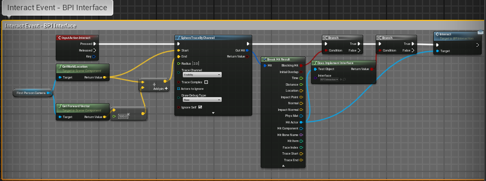

# EPIC GAMES - UNREAL ENGINE


>## Table of Content

  - [Introduction To Unreal Engine](#introduction-to-unreal-engine)
  - [Blueprints And Gameplay For Game Designers](#blueprints-and-gameplay-for-game-designers)
     - [Introduction To Course](#introduction-to-course)
     - [What Is a Gameplay Designer](#what-is-a-gameplay-designer)
     - [The First Person Character](#the-first-person-character)
     - [Changing Component Variables](#changing-component-variables)
     - [Experimenting With Variables At Runtime](#experimenting-with-variables-at-runtime)
     - [Adding Sprint](#adding-sprint)
     - [Adding Crouch](#adding-crouch)
     - [Adding Health And Debug Damage](#adding-health-and-debug-damage)
     - [Widget Blueprint Introduction](#widget-blueprint-introduction)
     - [Post Process Volumes](#post-process-volumes)
     - [Creating The Door Parent](#creating-the-door-parent)
     - [Opening On Overlap](#opening-on-overlap)
     - [Opening by Interacting with Another Actor](#opening-by-interacting-with-another-actor)
     - [Opening On Interact](#opening-on-interact)
     - [Opening Using a Blueprint Interface](#opening-using-a-blueprint-interface)
     - [Placing Sounds and Effects in the Level](#placing-sounds-and-effects-in-the-level)
     - [Playing Sounds and Particles in Blueprints](#playing-sounds-and-particles-in-blueprints)
---

# UNREAL ENGINE

 -[Toc](#table-of-content)


## Introduction To Unreal Engine

Unreal Engine is a game engine developed by Epic Games, first showcased in the 1998 first-person shooter game Unreal. Initially developed for PC first-person shooters, it has since been used in a variety of genres of three-dimensional (3D) games and has seen adoption by other industries, most notably the film and television industry. Written in C++, the Unreal Engine features a high degree of portability, supporting a wide range of desktop, mobile, console and virtual reality platforms.

The latest generation is Unreal Engine 4, which was launched in 2014 under a subscription model. Since 2015, it can be downloaded for free, with its source code available on a GitHub private repository. Epic allows its use in commercial products based on a royalty model, typically asking developers for 5% of revenues from sales, though Epic waives this fee for developers that publish their games through the Epic Games Store. On May 13, 2020, Epic announced that their portion of royalties for games developed in Unreal Engine are waived until developers have earned their first US$1 million in revenue, retroactively applying to January 1, 2020. Unreal Engine 5 is scheduled for full release in early 2022.

It is popular among PC and console games with high graphics capabilities and is used for numerous games, as well as finding further use in filmmaking and other business applications.


>## Blueprints And Gameplay For Game Designers
---
## Introduction To Course

 -[Toc](#table-of-content)

What You Will Learn :

- The role of a Gameplay Designer in a team with Unreal
- Change variables at runtime
- Debugging your work
- Setting up input for your project
- Setting up a parent blueprint
- Creating Child Blueprints to build on the logic of the parent
- Basics to Sounds and Particles
- Utilizing a Post Process Effect
- How to use Timelines
- The basics of UMG
----  
## What Is a Gameplay Designer

 -[Toc](#table-of-content)

 The responsibilities of a gameplay designer and what is expected of them on a beginner level in the team.

- Produce concepts for new gameplay items & systems
- Look for areas of improvemnt with the current design
- Author and Maintain Design Documents
- Work in a collaborative environment ,  Knowing how to communicate with other departments
- Be able to make quick iterations

Responsibilities in Unreal Engine
- Have a basic knowledge of most tools available in UE
- Know how to quickly change variables
- Be able to create new variations of existing actors

---
## The First Person Character

 -[Toc](#table-of-content)


A look at the player character Blueprint that’s already there before we start playing around with some movement variables.

Here are some most common variables that you need to know


Now open UNREAL ENGINE and go to first person template. 


Look for First Person Character Blueprint in the **content browser** OR just locate your asset by clicking on it and press **Ctrl+B** , it will take you directly to the asset in the content browser.
You can find it named BP_FirstPersonCharacter.


By double clicking on the BP_FirstPersonCharacter asset, you can enter into the character blueprint, where you can see the **EVENT GRAPH , CONSTRUCTION SCRIPTS , VIEWPORT , COMPONENTS , FUNCTIONS , VARIABLES , DETAILS PANEL** , etc...


---
## Changing Component Variables

 -[Toc](#table-of-content)

 In this topic we ,
   - Create our own Variables
   - Change variables on Begin play
     - Show comment functionality
     - Show editable variables
   - Level instance settings
     -Saving the level instance settings to your character

Here our goal is to overide Maximum walk speed and Jump Height with our on New variables.

Goto *First person player character*
We want to replace the variables that are part of **CharacterMovement** component. 

 

Drag and Drop the **CharacterMovement** component to the Event Graph to get the reference .

Drag  from the reference to **SET** or **GET** variables from the components. Look for *max walk speed* , you will get a **Get Max Walk Speed** and a **Set Max Walk Speed**. Select the **Set Max Walk Speed**. This will now overide the value of the variable in this component.

 

Now we want to do the same for JUMPING HEIGHTS.Look for **set jump z velocity** to overide the variable.


We want the jump overide to happen after we overidden the *max walk speed*. 


What happened now is , we have set the both variables to *zero*. Now we are going to create our on variables.
Goto **Blueprint** tab, under that, goto **Variables** tab and click on the *add variable* button.


Name the New variable as **FP_MaxWalkSpeed** (FP stands for First Person). Click on Enter and goto the **Details** panel.
Change the *Variable Type* from **Boolean** to **float**. To Edit the **DEFAULT VALUE** , you need to *compile* the code first. Now lets try changing the default value to 500 and then compile and save the same.


We have another method of creating a new variable. We can do it on *Max jump height*.


Right click on the *Green Node* near the **Jump Velocity** in the  **set jump z velocity** and click on **Promote to Variable**.
This will add a New variable and set its **Variable Type** automatically (Float in this case).
Now name the newly created variable as **FP_MaxJumpHeight**. Compile and set its Default value to 500. 
Value of Jump height would be now changed, but still you can see that value of Max walk speed is *zero*.
Goto the Variables tab and Drag **FP_MaxWalkSpeed** to the Event Graph. You can see a **GetFP_MaxWalkSpeed** and a **SetFP_MaxWalkSpeed**, select the **GetFP_MaxWalkSpeed** and connect it the node with **Max walk speed**. 


    You can hold Ctrl and Drag to get a GET variable
    and hold Alt and Drag to get a SET variable automatically.

Now we have just created some variables and nothing is there which is going to make this happen. The variables are never being called , they are just hovering in the Event Graph. We want them to happen as soon as the game starts. We need an Event for that.
Right click in the Event graph and look for the event **EventBeginPlay**.


Connect it to  **Set Max Walk Speed**. Now , as soon as the game starts , we overide the  **Max Walk Speed** with the new variable and we overide the **Jump z velocity** with the other new variable.

Even though the variables are responding, you won't be able to change them on the level instance over actor. It is because the variables that you made are not made to be public.
Goto the Blueprint tab on the First person player character and click on the *eye* icon to make it public. Now you would be able to make it public and it would be editable in the instance of the blueprint.


    Another method to make variable Public is to check tick mark on the INSTANCE EDITABLE in the DETAILS panel.

The next thing you would have to do is to make your EVENT GRAPH neat and clean. Select all the newly crated Events and variables and press **C** to **comment** it. Rename it and give a brief description. Here , we can name it as **Beginplay - Set movement variables**. Goto the details Panel and give a colour to recognise the Beginplay easily.


---

## Experimenting With Variables At Runtime

 -[Toc](#table-of-content)

We will add **DEBUG CONTROLS** that will allow us to change the variables while we play.

Here for a reference, we are Dynamically changing the variables with scroll wheel up/down.
We need the movement speed to go up , when we scroll the mouse wheel up and the movement speed to go down when we scroll the mouse wheel down.

Right click on the Event Graph and search for **Mouse Wheel Up** and **Mouse Wheel Down**.


You can see **Pressed** and **Released** in both of them.
We need a **Character Movement** to happen when the mouse wheel is **pressed** or **released** (Here we just need **pressed** to happen). So Drag the **CharacterMovement** component from the components tab. Set **Max walk speed** from it for both **Mouse Wheel Up** and **Mouse Wheel Down** and connect the **Max walk speed** to the **Pressed** in both.


Now we need to change the values. For that we need a **Get Max Walk Speed**. Drag a node from the **CharacterMovement** and search for **Get Max Walk Speed**. From the **Get Max Walk Speed**, drag a node and look for **float + float** to change the value when the wheel is scrolled up and **float - float** to change the value when the wheel is scrolled down. Change the float values to how much you want to increase or decrease the speed when scrolled. Lets take 100 for an example. 


Now compile and play to see the changes.
You can see that the speed has been changing whenever you scrolls the mouse wheel, but you wont have any idea on how much the current speed is while playing. For that we need to **Print string** to feedback the information about speed to ourselves.

Right click and search for **Print String** and connect it to the **Max walk speed**. To print back the information, connect the float with **Max walk speed** to the **String** in the **Print String**. Click the down arrow on the **Print String** and change the duration for how many seconds the string is to be displayed on the screen.


Do the same for **Mouse Wheel Down**. Then Compile and save.


Now play to see whether it is printing the speed on the screen or not. 


Now back to the Event Graph and select the changes we made to **comment** it out. Comment and describe the debug. Let it be **Debug - Change Movement Speed** and colour it down to recognise the debug (usually debugs are coloured in RED.)


---
## Adding Sprint

 -[Toc](#table-of-content)

 - Adding a new input to Project Settings
 - Using the new input in **First Person Character**
 - Setting up logic to adjust the speed for when the input is pressed and released.

To add a new input, goto the **Project Settings** and then under **Engine** click on **input**.
On **input**, you can see **Bindings**.
You will get **action mapping** and **axis mapping**.
Under **action mapping**, you will see *jump, fire* and *resetVR*. Click on the '+' button on **action mapping** to add a new input.


Rename the input to ***Sprint*** and assign keys to it by clicking '+' button next to it. Assign *left shift* key for it, or any other as if you are comfortable or may be multiple keys.


Goto the **First Person Character** Blueprint editor Event Graph and Right click and search for the event **Sprint**. You will be able to see the **InputAction Sprint**, having a **Pressed** and a **Released** actions.


Now you need the Character movement to happen. So, drag the **CharacterMovement** component and bring out **Set Max Walk Speed** from it for both  **Pressed** and **Released** and link them.


Make sure you have variable to change the speed. For that, you can goto **FP_MaxWalkSpeed** in the variables tab and *Duplicate* it and rename it as **FP_MaxSprintSpeed** and then compile and save to change the values.


    You can use Ctrl + W to duplicate. 

Select the **FP_MaxSprintSpeed** and goto the details panel and change the default value to 800. Compile and save.

Drag the variable **FP_MaxSprintSpeed** by holding **Ctrl** to get a *Get variable* to the Event Graph and connect it to the  **Set Max Walk Speed** while **Pressed** and drag **FP_MaxWalkSpeed** by holding Ctrl and connect it to the **Set Max Walk Speed** while **Released**. Compile and save and play.


It might be a good idea to keep track of the fact that if we are sprinting or not. So we want to create a new variable for that and that would be a **Boolean**. Add a new variable and name it as **IsSprinting**, as we need to know whether the character is sprinting or not.


You can keep it not editable for the level instance. 
Drag **IsSprinting** by holding **Alt** to get a **SET variable**. Drag one more copy of it to connect it up for both **Pressed** and **Released**. Give a check mark for **IsSprinting** in the **Pressed** and leave the **IsSprinting** in the **Released** as it is. Select the New changes that you have made and comment it down. Compile and Save.


---
## Adding Crouch

 -[Toc](#table-of-content)

- Adding a new input to Project Settings
- Using the new input to **First Person Character**
- Introduction to **Timeline**
  - Gradually change variables
  - Update component locations

Goto *project settings* and add a new input **Crouch** and assign keys to it. Let **C** and **Left Ctrl** be the crouching keys.


Now on the Event Graph, Right click and call the event **InputActionCrouch**. Assign **CharacterMovement** and **Max Walk Speed** when **Pressed** and **Released**.


Create a variable for maximum crouch speed. Duplicate the **FP_MaxSprintSpeed** in the variables tab and rename it as **FP_MaxCrouchSpeed**. Compile and Save and change the default value to 200.

Drag the variable (**GET variable**) out and connect to the **Max Walk Speed** when **Pressed**. Compile , Save and Play to see the result.


But we would not be getting a smooth motion while crouching. So, inorder to get a smooth motion, we need to use the **Timeline**.
Right click on the Event Graph and search for **Timeline** and Rename it as **T_Crouching**.


Assign it to **Play** while **Pressed** and **Reverse** while **Released** to get a smooth motion.


Double click on the **Timeline** to goto the **T_CrouchingTerminal**. You can see **Length** duration on it, it indicates how long we need to crouch down. Set the **Length** to 0.5 seconds.


We need to Gradually go from Value 1 to Value 2, for that we need to use a **Float Track**  . Click on the **Float Track Button** and name it **Crouch_Alpha** (an Alpha is a value that usually goes from 0 to 1). When the time is 0, we need the value to be 0, Right click on 0 in the timeline and add value of 0 to it.


And after 0.5 seconds on the timeline add a value of 1, that is, we need the the crouch to be completed at 0.5 seconds. You can see a straight line from value 0 to 1.


To smooth it out, select both the points, Right click on any of the points, and change the **key interpolation** to **User**.


Compile and Save and go back to the Event Graph. You can see a new output appeared, **Crouch Alpha**. 

To Crouch, we can either change the **Z** position of the **FirstPersonCamera** component by updating its **Set Relative Location** or a much better way to Crouch is to change the position of its **CapsuleComponent**. Updating the **FirstPersonCamera** component would not allow you to Crouch under obstacles. So, better way is to update the **CapsuleComponent** itself.

Drag the **CapsuleComponent** into the Event Graph and look for **Set Capsule Half Height** in it. From the **Half Height**, get a **Lerp** and connect the **Alpha** in the **Lerp** to the **Crouch Alpha** in the **Timeline**. Change Default value (check the default value of Capsule component from details panel) of the **CapsuleComponent** from 96 (put the value in **A** in the Lerp) to 50 (put the value in **B** in the Lerp) to Crouch. Connect the **update** from the timeline to the **CapsuleComponent**. Compile and Save. 


Now we need to make sure that we can check that we are Crouching or not. So we can select **IsSprinting**, duplicate it and rename it as **IsCrouching**.


Hold **Alt** and Drag it out and set it as when we Crouch it need to be True and when we stop it need to be False. Compile and Save to see the output.


But, here, as we are Crouching, we can enable Sprinting. We don't want that to happen. For that, goto Event Graph and go for **Add Custom Event** to add a custom event. Name the Custom Event as **StopCrouching**. Connect it to the **IsCo=rouching False** boolean, that is, it do not Crouch.

Go back to [Sprinting](#adding-sprint), which we already created and add a **Branch** in it.
```
Hold B on the keyboard and click to open a Branch or Right click and search for Branch
```

Connect **Branch** for both **Pressed** and **Released**. Drag a GET variable of **IsCrouching** and connect it to the **Condition** of both the **Branches**. So, when the Sprinting is True, connect a **Stop Crouching** event to it and when it is False, make it as Normal.


Now when we stop Crouching while we are Sprinting, it will still update the Maximum Movement Speed. So we would need to add another **Branch** in our **Crouch**. Add **IsSprinting** boolean to it and set as, when we stop Crouching, the input only has to happen if the Sprinting is False.


Compile, Save and Check the output by Playing.

---
## Adding Health And Debug Damage

 -[Toc](#table-of-content)

- Create a health variable
- Apply damage to Character using Debug Controls
- Restarting the level when the health reaches 0

Create a new *float variable* and Name it as **Health**. Compile and give its Default value as 100.


We are not going to edit the Blueprint instance, so, we can put the variable in the previous Debug we have made in [Experimenting With Variables At Runtime](#experimenting-with-variables-at-runtime). 


We can edit the comment and Remove the Description from it and comment it just **Debug**. Right click and add an input action for the key **P**, search for **P keyboard**.


**Get Health** variable and look for **Float - Float**. Select it and give a value of 10 to it, to subtract 10 health everytime when we press **P**.

Now **Set Health** and connect to the **P Keayboard Pressed**. Connect the value node of health with the **Float - Float**. So that now we are updating the Health.


Now we need to check if our health is *zero* or *lower than zero*. Because, in a game there are instances where your health could be negative. So drag off the **Health** node in **Set health** and look for **<=**. It turns out to be a bool, so we need to add a **Branch**. Hold **B** and **Left Click** to add a **Branch** and link everything up.


If this is True, we want to Restart the level. So we can **Execute Console Command** to do it. And inside of **Execute Console Command** in the **Command** type ***RestartLevel*** to restart the level. Compile, Save and Play.


---

## Widget Blueprint Introduction

 -[Toc](#table-of-content)

Here we will add a health-bar to our screen that will automatically stay up-to-date.

In the Blueprints, **First Person Template** folder in the **Content Browser**, Right click and goto **User interface** and **widget Blueprint**. Name it as **WB_HealthBar** (we are going to create a health-bar).


Open it up and look for **Horizontal Box** in the **Palette** tab as we need an **Horizontal box** for the **Health-Bar** and a text with it.


Drag it down to the graph, and resize it if you need.


In the **Palette** bar, drag the **text** under the **Common** and drop it on the **Horizontal Box** in the **Hierarchy**. Also drag a **Progress Bar** from the **Common** and drop it on the **Horizontal Box**.


Click on the **Text Bar** and you can see the Details panel. You can make necessary changes you need. Here we are going to change the name of the text to "**Health:** " and in the **Fonts**, we change the **Outline Settings**, *Outline size* to 1 and *Font Size* to 15. Compile and Save.


You can see the **Progress Bar** is small. Click on it and goto the **Details Panel** and in the **Slot Settings**, change the **Size** to **Fill**.


Do a **Vertical Allignment** to center, which will make it smaller vertically. Also change the Dimensions of the **Horizontal Box**, which would also change the dimensions of the **Health Bar**.


Click on the **Progress Bar** and on the Details panel, you can change the *percentage, color, style, etc...*  of the **Progress Bar**. You can change the Default color into green by setting the **Progress** percentage to 1 and then changing the **Fill color and opacity** in the **Appearance** to green.


Now you can goto the Graph to make the **WIDGET BLUEPRINT**. 


You need access to the Health and you need to be able to update Health. So you need to create a custom event, Right click and look for **Add Custom Event**. Name it as **UpdateHealthBar**.


Now we need a players health to update the Health Bar. So, in the **Details Panal**, by **UpdateHealthBar** selected, in the **Inputs** add a new input, **NewParameter**, which will add a Boolean automatically. Change the parameter from Boolean to Float. Rename **NewParameter** to **Health**.


Now the **Progress Bar** goes from 0 to 1, we have a maximum health of 100, so that would be 1. So our **current health**, we can divide by our **maximum health** in order to get its percentage going from 0 to 1. So, Drag of from **Health** node and go for **float / float** and divide it by 100.


Then we have a reference our **Progress Bar** on **Variables** tab in **My Blueprint** Panel.  Drag it down to the graph and do a **Get** variable. Then call **Set Percent** from it. So we could update the percentage of the **Progress Bar**. Connect the **UpdateHealthBar** and **Health** in it to the **Percent**. 


Now we need to see what the percentage is like. We need to change the colour of the **Progress Bar** depending on the health. So, call **Set Fill Color and Opacity** function from the **Progress Bar**, connect it to the percentage and add a **Select** function from it under **Utilities**.


We need to create a new rule now. Get from the Health and go for **float < float**. So that, if our Health is smaller, the colour changes. Let's do it for less than 50%. Connect it to the **Select Utility** and set the colour as Red if it's True and Green if False. Comment out the code as **Update Health Bar**, clear the preset nodes in the graph which are not used now, Compile and save.


Go back to our **First Person Player Character** Blueprint to start our Widget. We need to do it on the **BeginPlay**. On **BeginPlay**, we want to create a widget, which is called **Create Widget**. Set its class to our widget **WB_HealthBAr**.


We need the widget to be added to the viewport. Go for **Add to Viewport** function to add it to the viewport.


We also need a reference to our Health Bar widget. Right click on the **Return Value** of the widget and click **Promote to variable** and name ith **WB HealthBar**. Now we have a reference to it, so that we can make changes to it by calling events.

  


Now goto Debug section, which is the onnly place right now where we take damages.

Go for a **GET Health Bar** before the Branch takes place in the Debug and call **Update HealthBar** from it. Place it in Between and feed in the new health into the **Update HealthBar**.


Compile, Save and play to check the Health bar. Press **P** to see if it is reducing and changing its colours.


---

## Post Process Volumes

 -[Toc](#table-of-content)

- Specific settings for lower Health
- Use blend weight to gradually have the screen change to black and white.

Goto **First Person Character**, add a **PostProcess** component and compile.


With the **PostProcess** component selected, on the details panel, change the **Priority** to 1. This would give it a higher priority. Set the **Blend Weight** to 0, so by default it is not enabled. **Blend Weight** determines how much it should be applied to the scene. Put **Saturation** to 0, this would drain all the colours from the scene, then use the **Blend Weight** to update how heavy it is being applied to the scene.


Just as we updated our **Health Bar**, we want to update our **Post Process Volume's Blend Weight**. Goto the **Debug** and before the Branch, as we have done previously on [Widget Blueprint Introduction](#widget-blueprint-introduction) and **GET** a **Post Process** reference to it and go for **Set Blend Weight**. Make sure it is connected.


We can use a new function, **Map Range Clamped** instead of dividing the *current value* with the *maximum value*, which we did previously for getting percentsge. In the **Map Range Clamped**, you will have four numbers to be filled in, **In Range A, In Range B, Out Range A and Out Range B**. We have a range of going from **In Range A** to **In Range B**, let's start it when the Health is 70% (better to go with reduced health rather than going with 100%) and end the **Saturation** when it reaches about 20% of the Health. We do not want the **Post Process** to happen if we have the full Health, So put the **Out Range A** to 0 itself and we need the **Post Process** to be in full effect when our Health goes below 20, so , put the **Out Range B** to 1. Compile, Save and Play.


---

## Creating The Door Parent

 -[Toc](#table-of-content)

- Create a door parent actor
- Create a parent with the door opening functionality so we can do the rest in child actors
- Two custom events that feed into a play and rreverse timeline, then change the relative rotation on the door on that timeline

Goto the Blueprints folder and create a new folder called **Doors**. Inside **Doors**, Right click and create a **Blueprint Class**.


Select the **Actor** as the base and name it as **BP_Door_Parent**.


Open the **BP_Door_Parent**.


Now we need to add mesh into it. So, go for **Static Mesh** in the **Components**. Call it as **DoorFrame** and duplicate it or create a new **Static Mesh** and call it as **Door**. Compile and Save it.


Select the **DoorFrame** and goto Details panel and in the **Static Mesh**, look for **SM_DoorFrame**. Do the same for **Door**, select it and get a mesh **SM_Door**.


Now we need the Door to open and close. For that, goto the Event Graph, remove the unwanted preset events from it and add a **Custom Event** called **OpenDoor**.


Create another **Custom Event** for **CloseDoor** too.

Now we can add a **Timeline** and call it **DoorAnimation**. When **OpenDoor** starts, we will **Play** and for **CloseDoor**, we will **Reverse**. 


Enter the **Timeline**, set the Animation Length, 0.75 sec would be fine. Add a new **FloatTrack** and add a point at 0 and put the value 0. Add another point on 0.75 and put the value to 1. Select both the points and put the **Key Interpolation** to **User** to smoothen the animation. Compile and Save.


Back on the Event Graph, we need to **Update** the relative rotation of the **Door**. Grab the reference of the **Door** to the Event Graph and do a **Set Relative Rotation**. Connect **Update** to **Set Relative Rotation**. Also call a **Lerp Rotator** so that you would get an option to select the shortest path by checking tick mark on the **Shortest Path** option. It will prevent from rotating along the wrong side. Connect the **Door Alpha** with **Alpha** and **Z** rotation value from 0 to -110, that is, value of **Z** in **A** to be 0 and **B** to be -110, so that we would get a rotation of -110 degrees along the **Z** axis. 

Select all and Comment it down as **Door Animation**. Compile and Save.


----
## Opening On Overlap

 -[Toc](#table-of-content)

- Create your First Child Blueprint
  - Add an overlap component
  - Call parent behavior on overlap
  - Add a check to make sure it's the player character that's overlapping

Before creating the Door Child, goto **BP_Door_Parent**, and in the viewport, select **DefaultSceneRoot** in the components. In the Details panel, transform its size **Y** to 1.5 and **Z** to 1.3 to make the door little more larger that a Player could enter through it.

Now back into the folder, Right click on **BP_Door_Parent** and **Create Child Blueprint Class**.


Rename it as **BPC_Door_Overlap** and open it up. We want the Door to be open when the Player overlaps or gets close to it. We need a **Collision** component for that. Goto component and look for **Box Collision**.


Resize the shape of the Box in the Details panel. Change the **Box extent** in the **Shape** tab as **X = 400**, **Y = 250** and **Z = 200** (values are adjusted as per your view on from where you need to make overlap).


Now while scrolling down the Details panel, you can see Events. Click on the **+** sign with **On Component Begin Overlap** to create an Event.


Click on the **Box** component and add **On Component end Overlap**. So that now we have two Events, one for the Beginning and one for the End.


We need the door to open only when our Player Character enter and not any other **Pawn**. Drag on the **Other Actor** in the begin overlap and do a **Equal(Object)** and call a **Get Player Character** and connect them.


Now we need a **Branch**, click the Event Graph and hold **B** for that. Connect it with **On Component Begin Overlap** and its **Condition** with the **Equals**. When the **Begin overlap** is true, we need the  door to open, for that, from the **True** in the branch, get a **Open Door**. Do the same method to close the door on **On Component End Overlap**. Comment all of it as **Overlap - Open and Close Door**.


Compile and Save and go back to the player viewport and drag the **BPC_Door_Overlap** into it. Place it accordingly as you could see it including the volume. Save it and play to see its working or not.


---
## Opening by Interacting with Another Actor

 -[Toc](#table-of-content)

- Create a new actor that will serv as our pressure plate
- Assign a door in our level to open when standing on top of this actor

Instead on making a child blueprint of the parent, **BP_Door_Parent**, create a new blueprint actor (**Right click → Blueprint Class → Actor**) and call it **Bp_PressurePlate**. Double click on it to open it up.

Add a **Static Mesh** component as done before and name it **PressurePlate**. Set the Mesh to a **Cube** and Scale it's **Z** value to **0.1** and Compile.


Add new **Box Collision** and adjust it's size and position according to the Cube mesh.


On the Details panel, in the Collision, set the Collision Preset as **OverlapAllDynamic** and enable **Generate Overlap Events** ✅.

This way, anything Dynamic we throw on top of it with **Generate Overlap Events** enabled would create an overlapping event. Compile and Save.

Now create a **Begin overlap** and an **End overlap** as previously created on [Opening On Overlap](#opening-on-overlap).
We need to open the door when overlaps (You cant find our previously created **Open Door** event here, as we are not in the same parent), we need a reference to a door. We can do that by making a new variable, call it **Door_Reference**, and in the Details panel, change its variable type to **BP_Door_Parent** and set it as an **Object Reference** and the same needed to be editable, (Instance Editable ✅).


Compile and Save it.

Hold Ctrl and Drag out the **Door Reference** into the graph so that we get a reference and now call the **Open Door**.


But, we can't just call **Close Door** when the overlap stops. That is, if we walk away from the Pressure Plates, the door would close. So, what we need to do here is, Drag a reference of the **Box** into the graph and do a **Get Overlapping Actors** and set its **Class filter** as **Actor**.


This would return you an Array, a list of all the actors that are currently overlapping. But we just need to know that, if the first result is a valid result or not, because, if the first result is not valid, then we know that we can close the door. So we can **Get(a copy)** to get the first one in the list. But the first one in most cases would be the Actor itself, so set its value to 1 (first would be 0 and the next would be 1 in an array) and then go for "**? Is valid**" and connect it with **On Component End Overlap** to get an Event.


And if it is not valid, we will close the door. Connect **Close Door** from the **Door Reference**. Compile and Save.


Place a new **BP_Door_Parent** into the scene and the **BP_Pressure_Plate**. position the Pressure Plate as if the Cubes are near to it so that it could get pressed if the cubes fall on it.


Now in the Details Panel, we need to set the **Door Reference** to **BP_Door_Parent**. If you set a refernce variable to a parent, you can also get access to all of its children.


Select the Cubes and enable **Generate Overlap Events** ✅ to them, so that they cuold generate ovelapping events. Play it to see if it works.


---
## Opening On Interact

 -[Toc](#table-of-content)

- Create a new child blueprint of Door Parent
- Enable input to the door
- Open the door when a certain button is pressed

Take **BPC_Door_Overlap**, instead of creating a child blueprint, we will duplicate it and call it **BPC_Door_Interact** and open it up.

What we are going to do now is, enable the input on the door when our player approaches and there will have an *interaction event* triggered to open the door. So, we need to get an **Interaction Event** or **input**. Goto **Project Settings** → **Engine** → **Input** → **Action Mapping** and add a new action mapping. Name it as **Interact** and set **E** as the keyboard key.


Now we can go back to the door and say **Interact**.


But when we press **E** on the keyboard, this would never happen. We need to enable input on this actor. So, in the **Overlap - Open and Close Door** session, where we have been already specifically checking the player character and nobody else could trigger it. Now go for  **Enable input** and we have a **Target**, which is **Self**, and a **Player Controller**. For the **Player Controller**, do a **Get Player Controller**. The Player Controller is a thing that processes all your player inputs, so it's also the one everything to the player character. Delete the **Open Door** from the **Branch** and connect the **Branch** with **Enable Input**.


Just like we can **Enable** it, we can also **Disable** it, Drag from the**GetPlayerController** and go for **Disable Input**. Unlink it from the **Target** and connect it with **Player Controller** and let the **Target** remain **Self**. Delete the **Close Door** and connect the **Disable Input** with it.


Now we have our **Input Action Interact**, whenever we press, door needs to be open and pressed again to close the door. We can add a **Flip Flop** for that. For the **A** (that is, when pressed first time) we need to open the door and for **B** (that is when pressed again) we need to close the door.


Goto the viewport and add a **TextRender** component.


Make the text as **E**, that's the button we are using to interact with. Duplicate it and make sure it is placed on the other side of the door too.


Make the texts as children of the door as it won't mess up with the movement of the door. Drag both the Texts under the door to make them as children.


In the Details panel, enable **Hidden in Game** ✅ in the Rendering. Goto the Event Graph and get the reference of the two texts, because, when our player enters the box and he can interact, we want the texts to be visible. Find **Set Hidden in Game** and connct it with **Enable Input** and both the text should be the targets. Make the **New Hidden** false. Do the same for **Disable Input** but make the **New Hidden** ✅ true here.


Go back to the viewport and make the **Box** smaller, so that we can interact only when the player is closer to the door. Compile and Save.


On the User viewport, place the **BPC_Door_Interact** and play to see the result. You can see the text pop up when the player is closer to the door and when you press **E**, it opens and pressed again, it closes.


---
## Opening Using a Blueprint Interface

 -[Toc](#table-of-content)

We will create a Blueprint Interface, which makes it easier to communicate between Actors.

- Create a new child blueprint of door parent
- Create a new interface
  - Add the interface to new child
- Open the door through the player
  - Create a new sphere trace
  - Open the door when we are close
    - Add a retriggarable delay for closing the door automatically again

Goto **Bluprints → FirstPersonTemplate**, in that folder, Right click and goto **Blueprints → Blueprint Interface** and call it **BPI_Interaction**.


Open it up and create a new function named **Interact**.


So now we have a function called **Interact** as part of the **BPI_Interface**. We can actually get that logic into door child.

Go back to **Blueprints → Doors** folder and make a new child of the **BP_Door_Parent** and call it **BPC_Door_Interface** and open it up. Now we want to add **Interface** to the actor **BPC_Door_Interface**. You can do that at the **Class Settings**. Click on the **Class Settings** in the toolbar, and in the Details Panel, you can see **Inerfaces** and that would be empty, so you can add an interface. Search for **BPI_Interaction** in it.


In the **My Blueprints** tab you can see the **Interact** function just appeared.


You can now Right click on it and click **Implement Event**. You can see **Event Interact**. We can now use this **Event Interact** to execute the logic that we want. 

Do a **Flip Flop** and put **A** to **Open Door** and **B** to **Close Door**. Compile and Save it.


We will set up the interaction in the **FirstPersonPlayerCharacter**. Goto **Blueprints → FirstPersonTemplate → FirstPersonCharacter** and open it. We need to add our new **Interact** input action. Search for **Interact** and you will get a **Interact Input Action**. When **Pressed**, we will have a look if we are standing infront of something that can be interacted with. Do a **SphereTraceByChannel** from **Pressed**.


It needs a start and an end point, the trace would draw lines between start and end points in certain radius and look for actors to interact with. The start point in this case could be our **FirstPersonCamera**. Get the camera into the graph and to get it's location, do a **GetWorldLocation** and connect its **Return Value** to the **Start**.


For the **End** point, we can use the **Forward Vector** of the camera so we get the directions that it will look at. Do a **GetForwardVector** from the camera, multiply that with a **float** to detrmine the range at which we can interact with the actors. Then we need to add it back to the original world location. Look for **Vector + Vector** from **GetWorldLocation**. Give a value of 500 units (500 cm) to the float and join the **Vector + Vector** and that to the **End**. Set the **Radius** to 2 in the **SphereTraceByChannel**. Also enable **Draw Debug Type** to **For Duration** and Compile and Save.


Play and check whether the Trace works or not. Now we just need to interact with an actor. We need to give **Out Hit** results.


Go for **Break Hit Result** and extract it down. Add a **Branch** for **Blocking Hit** and connect it with **SphereTraceByChannel**. If did hit something, how does we know that the actor actually have our interaction interface?, there is a function for that we can call, look for **Does Implement Interface** from **Hit Actor**. **Select class** as our **BPI_Interaction** in it's **Interface**.


If its is True, we can send a **message** using our interface. So make another **Branch** and connect it with **True** of the other **Branch** and connect the **Condition** to the **Does Inplement Interface**. Now call **Interact (message)** from **Hit Actor** and connect it to the **True** of the **Branch**. It sends a message to the actor and if the actor has its interface, it will execute that event that we added.


Compile and Save. Now goto the player map and add a new **BPC_Door_Interface** to the player viewport. Have a look whether you can interact with the door and open it. But you can't open the door if you look at it directly, it would open only if you are looking at its frame. It's because the collision on the door is either not set correctly or it's not present. So, goto the **BP_Door_Parent**, selct the **Door** and in the Details panel, Go into the **Static Mesh** and check that the collision is enabled or not by double clicking on the **Mesh**. Enable its **Simple Collision** to see whether there is any collision with it.


There won't be any collision in the **FirstPersonStarter** Pack for the door. To add Collison, goto **Collision → Add Box Simplified Collision** to get a simplified box collision into the door. Hit Save and go back to Play.


Check whether you can open the door by looking straight to it rather than looking to the frame.


Now if its working, you can goto the **FirstPersonPlayerCharacter** Blueprint and set the **Draw Debug Type** to **None**. Comment down everything as **Interact Event - BPI Interface** 



---
## Placing Sounds and Effects in the Level

 -[Toc](#table-of-content)

How to add extra layers of polish to your work by adding sounds and particle effects to your level.

- Add a steam sound and particle to our level

We can start by adding particles into the scene. Goto **Content → StarterContent → Particles** folder and you can see the starter content particles there. Let's grab one of them and place it in the scene, take **P_Sparks** for spark particles.

For adding sounds, goto **Content → StarterContent → Audio**, you can see two types of files, **Cue** and actual sound files. Usually you want to add a Cue,  because you can do a lot of things in a Cue. For example, open the Fire Sparks Cue. Click on the **Looping Wave Player** and set it to **Looping** in the Details panel.


Place the audio into the screen with the Sparks particle and Play. You can see the sound gradually increaces while you are approaching the particle and diminishing while you are moving away from it.


---
## Playing Sounds and Particles in Blueprints

 -[Toc](#table-of-content)

- Adding Sounds and Particles using Blueprints
  - Explotion on Ball Projectile
- Changing the Projectile to be destroyed before self-destruct (So we can use the particle and sound)

Goto **Content → Blueprints → FirstPersonTemplate** folder and select the **BP_FirstPersonProjectile**, which is the ball which our player shoots.


You can see that the ball gets destroyed only if we applied impulse somewhere. Now we need to add sounds and particles into it. Just before **Destroy Actor**, Right click and look for **Play Sound at Location**. We already have a **GetActorLocation**, connect it with the **Location**, and connect the **impulse at Location**.


Do the same method to add particles. For particles, do a **Spawn Emitter at Location** node and connect it with location and make it in an order as, after the impulse, we play sound, after the sound, we play the particles and then destroy the actor. Look for **Explosion** in **Sound** as well as in **Emitter Template**.


Compile and Save to see what happens.

But you can still see the balls rolling around and disappearing. To see thats, goto **Class Settings**, and in **Actor**, you can see that it has a life span of 3 seconds and after that 3 seconds it is destroyed. Reset it to default, it would be 0, so that, it is never being destroyed.


But we actually needs the ball to get destroyed. So, what we will do is, just create a **Event BeginPlay**. Then go for a **Delay** and set it's **Duration** to 3 seconds and after the 3 seconds, continue with the logic on sound and particles.


Change the **Scale** in  **Spawn Emitter at Location** to **X = 2.5, Y = 2.5 and Z = 2.5** and change the **Veloclity** to 1000. Compile and Save and Play to see the Explosions.


---
***KEEP LEARNING***
---
---
---
